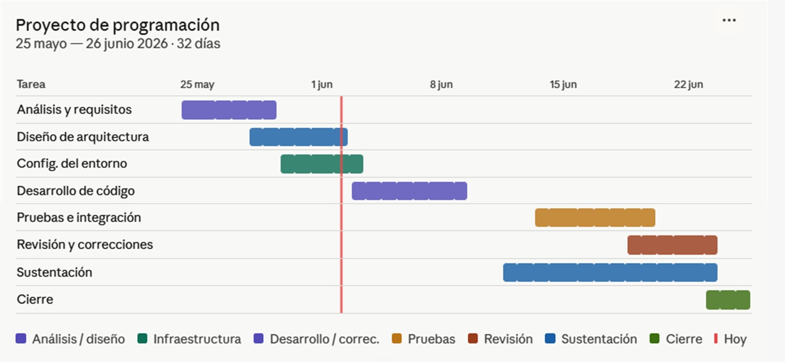
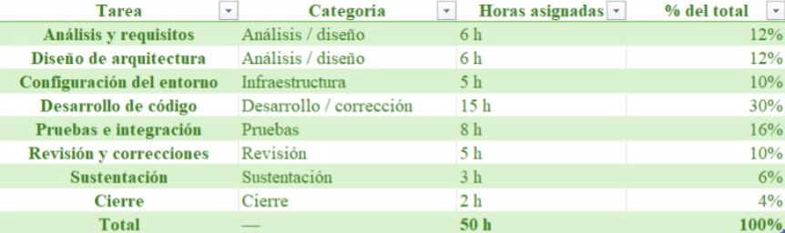

# Sistema de préstamos - MJ

## Integrantes e información académica

### Anthony Rentería

- Programa: Ingeniería Industrial
  
- Habilidades:
  - Excel
  - Lógica
  - Idiomas

- Fortalezas:
  - Creatividad
  - Gestión
  - Resolución de problemas
 
### Jamal Pimienta Duarte

- Programa: Ingeniería Industrial
  
- Habilidades:
  - Análisis de problemas
  - Buena socialización
 
- Fortalezas:
  - Resolución de conflictos
  - Toma de decisiones
  - Empatía

### Britania Hernandez Anaya

- Programa: Ingeniería Industrial
  
- Habilidades:
  - Responsabilidad
  - Organización
  - Compromiso

- Fortalezas:
  - Aprendizaje rápido
  - Trabajo en equipo
  - Adaptación al cambio

### Manuela Velásquez Garzón

- Programa: Ingeniería Industrial
  
- Habilidades:
  - Responsabilidad
  - Disciplina

- Fortalezas:
  - Trabajo en equipo
  - Resolución de problemas
  - Buena comunicación
  
  
## Reporte de visión

### Descripción general del software

Este es un software desarrollado en Python que permite administrar el préstamo de artículos mediante una interfaz de consola interactiva y amigable para el usuario. El sistema utiliza archivos planos para almacenar la información de usuarios, artículos, préstamos, devoluciones y ventas, permitiendo llevar un control organizado y eficiente de todos los procesos relacionados con el inventario y los préstamos.

El software fue diseñado para automatizar tareas que normalmente se realizan de manera manual, reduciendo errores y mejorando el control de los artículos prestados. Además, permite generar certificados de devolución, facturas automáticas por incumplimiento y exportar la información almacenada a archivos CSV para facilitar el análisis y la gestión administrativa.

---

### Objetivo general

Desarrollar un sistema de consola en Python que permita gestionar de manera eficiente el préstamo de artículos, controlando usuarios, inventario, préstamos, devoluciones y ventas mediante el uso de archivos planos y exportación de datos en formato CSV.

---

### Objetivos específicos

- Registrar usuarios con validaciones de seguridad y formato.
- Registrar artículos con categorías e identificadores únicos.
- Gestionar préstamos y devoluciones de artículos.
- Controlar el estado de disponibilidad de los artículos.
- Generar certificados de devolución automáticamente.
- Generar ventas automáticas por incumplimiento de devolución.
- Exportar información a archivos CSV.
- Implementar un módulo administrativo protegido mediante autenticación.
- Generar reportes y estadísticas del sistema.

---

### Beneficios del software

- Automatiza el proceso de préstamos y devoluciones.
- Reduce errores humanos en el registro de información.
- Mejora el control del inventario.
- Facilita el seguimiento de usuarios y artículos.
- Permite generar reportes administrativos rápidamente.
- Mejora la organización y almacenamiento de la información.
- Permite exportar datos para análisis externos.
- Brinda mayor seguridad mediante validaciones y control administrativo.
- Ofrece una interfaz sencilla y fácil de utilizar.

# Especificación de Requisitos

## Requisitos Funcionales

Los requisitos funcionales describen las funciones, acciones y comportamientos que el sistema debe ejecutar para cumplir las necesidades del usuario.

### Gestión de Usuarios

- El sistema debe permitir registrar usuarios.
- El sistema debe validar que el nombre y apellido tengan mínimo 3 caracteres y no contengan números.
- El sistema debe validar que el documento tenga entre 3 y 15 caracteres numéricos.
- El sistema debe validar que el correo electrónico contenga “@” y termine en “.com”.
- El sistema debe permitir seleccionar únicamente tiempos de préstamo de:
  - 5 días
  - 10 días
  - 15 días
  - 30 días

---

### Gestión de Artículos

- El sistema debe permitir registrar artículos.
- El sistema debe permitir asignar categorías a los artículos.
- El sistema debe generar automáticamente un ID único para cada artículo.
- El sistema debe asociar el ID con la categoría del artículo.
- El sistema debe registrar el precio de compra del artículo.
- El sistema debe manejar el estado del artículo mediante lógica difusa:
  - 1 = disponible
  - 0 = prestado

---

### Gestión de Préstamos

- El sistema debe permitir registrar préstamos únicamente a usuarios existentes.
- El sistema debe impedir préstamos a usuarios no registrados.
- El sistema debe verificar la disponibilidad del artículo antes de prestarlo.
- El sistema debe registrar fecha de préstamo y fecha límite de devolución.
- El sistema debe actualizar automáticamente el estado del artículo cuando sea prestado.

---

### Gestión de Devoluciones

- El sistema debe permitir registrar devoluciones únicamente de préstamos activos.
- El sistema debe validar si el usuario tiene préstamos activos.
- El sistema debe actualizar el estado del artículo cuando sea devuelto.
- El sistema debe generar un certificado de devolución automáticamente.
- El sistema debe guardar el certificado como archivo de texto plano.

---

### Gestión de Ventas

- El sistema debe generar automáticamente una venta cuando el préstamo supere los 30 días.
- El sistema debe calcular automáticamente un impuesto del 23%.
- El sistema debe generar una factura de venta.
- El sistema debe guardar la factura como archivo de texto plano.

---

### Consultas y Reportes

- El sistema debe permitir consultar artículos con más de 30 días prestados.
- El sistema debe mostrar el estado general de los préstamos.
- El sistema debe organizar los préstamos según la cantidad de días transcurridos.
- El sistema debe generar estadísticas generales del sistema.
- El sistema debe exportar información a archivos CSV.

---

### Administración

- El sistema debe tener un módulo administrativo protegido por usuario y contraseña.
- El administrador debe poder consultar:
  - total de préstamos,
  - total de devoluciones,
  - total de ventas,
  - total de pagos,
  - lista de usuarios,
  - usuario con más préstamos,
  - usuario con menos préstamos.

---

# Requisitos No Funcionales

Los requisitos no funcionales describen características de calidad y criterios que determinan cómo debe funcionar el sistema.

## Rendimiento

- El sistema debe responder rápidamente a las acciones del usuario.
- El sistema debe permitir manejar múltiples registros sin afectar significativamente el rendimiento.
- El sistema debe optimizar el uso de archivos planos para consultas rápidas.

---

## Seguridad

- El sistema debe restringir el acceso al módulo administrador mediante autenticación.
- El sistema debe validar correctamente los datos ingresados por el usuario.
- El sistema debe evitar registros inválidos o incompletos.

---

## Usabilidad

- El sistema debe tener una interfaz de consola sencilla y fácil de entender.
- El sistema debe mostrar mensajes claros al usuario.
- El sistema debe facilitar la navegación mediante menús organizados.

---

## Fiabilidad

- El sistema debe almacenar correctamente la información en archivos planos.
- El sistema debe mantener consistencia en los datos registrados.
- El sistema debe evitar pérdidas de información durante el uso del software.

---

## Compatibilidad

- El sistema debe ser compatible con Python 3.
- El sistema debe funcionar en sistemas operativos Windows, Linux y macOS.
- El sistema debe permitir exportar información en formato CSV compatible con Excel.

---

## Mantenibilidad

- El código debe estar organizado y documentado.
- El sistema debe permitir futuras mejoras y ampliaciones.
- La estructura del proyecto debe facilitar el mantenimiento del software.

---

## Escalabilidad

- El sistema debe permitir agregar nuevas funcionalidades en futuras versiones.
- El sistema debe soportar el crecimiento de usuarios y artículos registrados.

---
## Diagrama de Gantt

## Presupuesto

